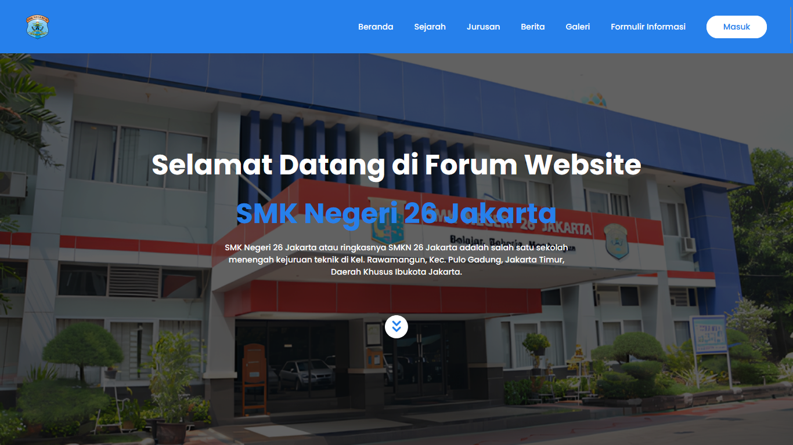

# 🏫 Website Resmi SMKN 26 Jakarta

---

## 📝 Deskripsi

**SMKN 26 Jakarta** adalah website profil resmi sekolah yang menyajikan informasi seputar jurusan, program keahlian, berita terbaru, pendaftaran, galeri kegiatan, dan kontak sekolah.  
Website ini dikembangkan menggunakan **Laravel (PHP)** untuk backend, **MySQL** sebagai database, **Tailwind CSS** untuk styling modern, dan **JavaScript** untuk interaksi dinamis.  
Tujuannya adalah memberikan akses informasi resmi yang cepat, responsif, dan mudah diakses bagi siswa, guru, orang tua, dan masyarakat umum.

---

## 🚀 Teknologi yang Digunakan

| Teknologi  | Deskripsi Singkat |
|------------|-------------------|
|  **Laravel** | Framework PHP modern untuk pengembangan backend yang terstruktur dan efisien. |
|  **PHP** | Bahasa pemrograman utama untuk backend. |
|  **MySQL** | Database relasional untuk menyimpan data sekolah, berita, jurusan, galeri, dll. |
|  **Tailwind CSS** | Utility-first CSS framework untuk styling yang modern, cepat, dan responsif. |
|  **JavaScript** | Interaksi dinamis dan peningkatan user experience (UX). |

---

## ✨ Fitur Utama

### 🏫 1. Profil Sekolah
Informasi lengkap tentang sejarah sekolah, visi-misi, jurusan, dan program keahlian.

---

### 📰 2. Berita & Informasi Terbaru
Update kegiatan sekolah, pengumuman, dan event.

---

### 📝 3. Informasi Pendaftaran
Panduan dan informasi lengkap untuk pendaftaran siswa baru.

---

### 📸 4. Galeri Kegiatan
Galeri foto kegiatan sekolah yang ditampilkan secara rapi dan menarik.

---

### 🌐 5. Responsive Design
Website dirancang **sepenuhnya responsif**, nyaman digunakan di semua perangkat.

---

## 🎯 **Tujuan Website**
- Menyediakan akses informasi sekolah secara online.
- Mempermudah siswa, guru, orang tua, dan masyarakat mendapatkan informasi resmi.
- Meningkatkan citra dan branding digital sekolah.

---

## 📝 Penutup
Website **SMKN 26 Jakarta** dibangun dengan teknologi modern, fokus pada kemudahan akses, performa, dan tampilan yang profesional.

---
